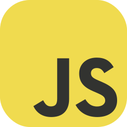

<div align="center">
    
#### 🖥️ Self-taught programmer

#### 🎓 Currently a student at Universiti Teknologi Malaysia

#### 🏓 Table tennis and badminton when I'm not coding

#### 👀 I'm a tab hoarder

</div>

## Tool Box 🧰

<div align="center">





</div>

## Featured Projects 🔥

<div align="center">

<a href="https://github.com/KaifHalak/LAN-TicTacToe" target="_blank">

</a>

<a href="https://github.com/KaifHalak/Speed-Typer" target="_blank">
     
</a>

<a href="https://github.com/KaifHalak/YoutubePlayerClone" target="_blank">
    
</a>

<a href="https://github.com/KaifHalak/JobBoard" target="_blank">
    
</a>

</div>

---

## Lets Collaborate 🤝

### Available for freelance work:

<div align="center">

```typescript
Full-Stack Web Application | Chrome Extension | Discord Bot | Google App Script
```

</div>

email = `m.usmanvv@gmail.com`

<!-- Icons: https://github.com/tandpfun/skill-icons
Typing text: https://readme-typing-svg.demolab.com (color - #23D18BFF) -->
